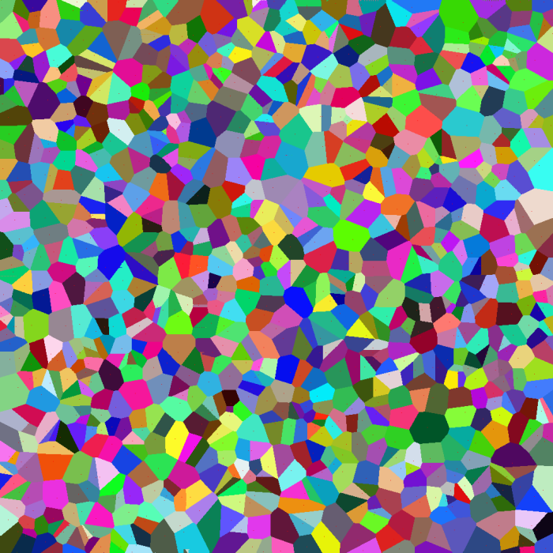

## High-Perfomance-Computing-projects-CIS677
This repo includes projects from high performance computing course - **CIS 677 in  GVSU**

### MPI for Genomics: Genome-wide Association Study (GWAS)
- Problem Description:
The aim of this project is to develop an **MPI-based message-passing application/program** that analyses raw microarray data and identifies top differentially expressed genes between the ***Renal and Control groups*** of patient samples.
----------------------------------------------------------------------------------------------------------------
#### - Random T-Test distribution and D scores of some of the top discriminant genes i.e., GENE377X and GENE2107X:

  
  

#### - Top 20 Discriminant Genes from both Sequential and MPI Parallel Programs:

  
  

#### - Open MPI Speed Up (~100X):

  
  

-----------------------------------------------------------------------------------------------------------------------------------

### GPU-Accelerated computation of Voronoi Diagram

- The main idea is to write a CUDA-based massively multi-threaded application that when given a set of seeds and a 2-dimensional canvas, computes a discrete approximation of the corresponding Voronoi diagram.
----------------------------------------------------------------------------------------------------------------

#### - Voronoi images for different seed sizes (1024 & 10,000)

  
  

  

#### - Performance Analysis

  
  

